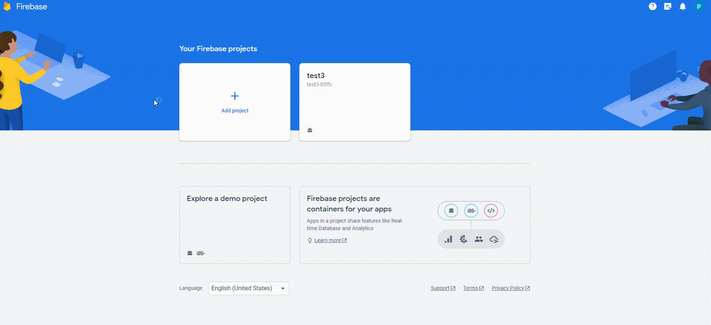
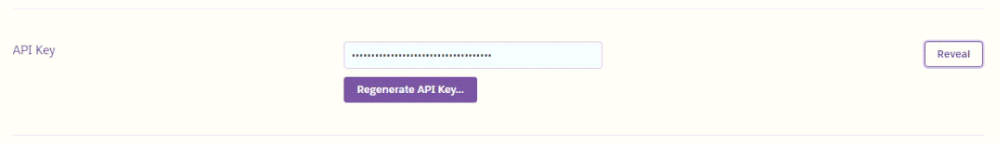
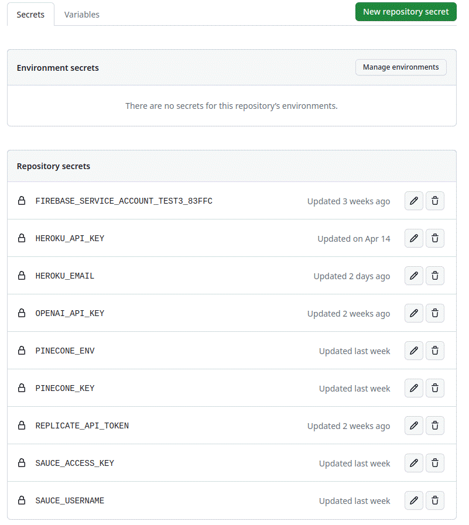

# RisingBrain

The goal of this project is to develop a phone operating system that replaces the traditional UI of an Android-based smartphone with ChatGPT. The AI will manage control of all apps via plugins, which can be prompted by the user.

## 1. Description

### 1.1 Achievement
Develop a langchain plugin that sends Android system notifications to the user. Should be able to use a langchain agent.
Allow user to launch browser app on a specific webpage or to search an image , and others more. 

<p align='center'>
  
</p>

### 1.2 Architecture
<p align='center'>
  
</p>

- make app documentation and embed it.
- embed the query that risingphone sends to local llm
- calculate similarity between embedded app documentation and query and get the best similar app
- get completion based on query and app data using langchain
- send the result to risingphone using firebase clouding message

### 1.3 Goal
Android-based smartphone operating system that utilizes ChatGPT as the primary user interface.
Control of all apps through AI prompting and execution via plugins.


## 2. Installing / Getting started
### 2.1 how to run on local


    git clone https://github.com/ttt246/RisingBrain.git
    pip install virtualenv
    virtualenv venv
    pip install -r requirements.txt
    set flask = app.py
    run flask


### 2.2 Create firebase project
<p align='center'>
  
</p>

### 2.3 Create Android app and download serverAccount.js
<p align='center'>
  
</p>

### 2.4 Create Firebase Collection
<p align='center'>
  
</p>

### 2.5 Get Heroku Api key
<p align='center'>
  
</p>

### 2.6 Set Github Secrets
<p align='center'>
  
</p>

## 3. Developing


### 3.1 make app documentation and embed it

#### 3.1.1 make app documentation

| Prompt Template |
| ------------ |
| If user is going to run web browsers such as Firefox, Google Chrome, Safari, Microsoft, Opera, Internet Explorer, Mosaic, Chromium, Brave, etc, please answer belowing json format. <br> The url user is going to open can exist or not. If user doesn't say exact url and want to open some sites, you have to find the best proper url. If user don't say url or you can't find proper url, please set url to "http://www.google.com". <br><br>{"program": "browser", "url": "website url that user is going to open"} |
| If user is going to send notification or alert, please answer belowing json format. If user didn't say what to send, please set content to "This is notification" <br><br>{"program": "alert", "content": "text that user is going to send"} |
| If user is going to say about a image with its description to search, please answer belowing json format. . {""program"": ""image"", ""content"": ""description of the image that user is going to search""}| 
| If user is going to ask about a image, please answer belowing json format. . {""program"": ""image"", ""content"": ""description of the image that user is going to search""}| 

#### 3.1.2 embed app documentation
```python
def csv_embed():
  loader = CSVLoader(file_path='phone.csv', encoding="utf8")
  data = loader.load()
  embeddings = OpenAIEmbeddings(openai_api_key=OPENAI_API_KEY)
  result = list()
  for t in data:
    query_result = embeddings.embed_query(t.page_content)
    result.append(query_result)
  with open('phone.json', 'w') as outfile:
    json.dump(result, outfile, indent=2)
```

### 3.2 get completion using langchain

```python
    #import embedded app documentation
    llm = OpenAI(
        model_name="gpt-3.5-turbo", temperature=0, openai_api_key=OPENAI_API_KEY
    )
    chain = load_qa_chain(llm, chain_type="stuff")
    with open("src/langchain/phone.json", "r") as infile:
        data = json.load(infile)

    #embed query that risingphone sends to local llm
    embeddings = OpenAIEmbeddings(openai_api_key=OPENAI_API_KEY)
    query_result = embeddings.embed_query(query)

    #get best similarity app data
    doclist = utils.maximal_marginal_relevance(query_result, data, k=5)
    loader = CSVLoader(file_path="src/langchain/phone.csv", encoding="utf8")
    csv_text = loader.load()
    docs = []
    for res in doclist:
        docs.append(
            Document(
                page_content=csv_text[res].page_content, metadata=csv_text[res].metadata
            )
        )

    #get completion based on query and app data
    return str(chain.run(input_documents=docs, question=query))
```

### 3.3 send message using firebase clouding message and firestore

```python
import os
import sys
import traceback
import firebase_admin
from firebase_admin import messaging, credentials, firestore

os.environ[
    "GOOGLE_APPLICATION_CREDENTIALS"
] = "src/firebase/test3-83ffc-firebase-adminsdk-bnkcl-b00f7bb1ff.json"

# firebase setup
# check if GOOGLE_APPLICATION_CREDENTIALS env variables exists
if os.getenv("GOOGLE_APPLICATION_CREDENTIALS", None) == None:
    print("GOOGLE_APPLICATION_CREDENTIALS Not Found.")
    print("Check environment variable.")
    exit()

firebase_admin.initialize_app()

db = firestore.client()


def get_tokens():
    users_ref = db.collection("users")
    docs = users_ref.stream()
    registeration_tokens = []
    for doc in docs:
        registeration_tokens.append(doc.to_dict()["token"])
    return registeration_tokens


def exception_detail(e):
    error_class = e.__class__.__name__
    detail = e.args[0]
    cl, exc, tb = sys.exc_info()
    lastCallStack = traceback.extract_tb(tb)[-1]
    fileName = lastCallStack[0]
    lineNum = lastCallStack[1]
    funcName = lastCallStack[2]
    errMsg = 'File "{}", line {}, in {}: [{}] {}'.format(
        fileName, lineNum, funcName, error_class, detail
    )
    return errMsg

def send_message(notification, token_list):
    if token_list == []:
        return False, "token_list empty"
    if notification.get("title") not in [None, ""]:
        notify = messaging.Notification(
            title=notification.get("title"), body=notification.get("content", "")
        )
        android_notify = messaging.AndroidNotification(
            title=notification.get("title"),
            body=notification.get("content", ""),
            default_sound=True,
        )
    else:
        notify = messaging.Notification(body=notification.get("content", ""))
        android_notify = messaging.AndroidNotification(
            body=notification.get("content", ""), default_sound=True
        )

    multi_msg = messaging.MulticastMessage(
        notification=notify,
        tokens=token_list,
        data={} if "route" not in notification else {"direct": notification["route"]},
        android=messaging.AndroidConfig(notification=android_notify, priority="high"),
        apns=messaging.APNSConfig(
            payload=messaging.APNSPayload(
                messaging.Aps(sound=messaging.CriticalSound("default", volume=1.0))
            )
        ),
    )
    response = messaging.send_multicast(multi_msg)
    failed_tokens = []
    if response.failure_count > 0:
        responses = response.responses
        for idx, resp in enumerate(responses):
            if not resp.success:
                # The order of responses corresponds to the order of the registration tokens.
                failed_tokens.append(token_list[idx])
        print("List of tokens that caused failures: {0}".format(failed_tokens))
    return True, "send to {} devices, with {} successed, with {} failed.".format(
        len(token_list), response.success_count, response.failure_count
    )
```

## 4. Testing

### 4.1 Integration Test

```python
import re

from src.langchain.chatbot import getCompletion
from src.firebase.cloudmessage import send_message
from src.firebase.cloudmessage import get_tokens

# test langchain plugin
def test_langchain():
    error = "Error happend while analyzing your prompt. Please ask me again"
    result = getCompletion("open three.js website")
    print(result)
    assert result != error

#test firebase clouding message
def test_firebase_cloud_message():
    token_list = get_tokens()
    notification = {"title": "alert", "content": "test"}

    pattern = r"send to \d+ devices, with \d+ successed, with \d+ failed."

    state, value = send_message(notification, token_list)
    assert re.match(pattern, value)
```

### 4.2 Main Test
```python
import pytest
from app import create_app


@pytest.fixture(scope="module")
def test_client():
    flask_app = create_app()

    # Create a test client using the Flask application configured for testing
    with flask_app.test_client() as testing_client:
        # Establish an application context
        with flask_app.app_context():
            yield testing_client  # this is where the testing happens!
```
### 4.3 SauceLab Test
You can configure ./sauce/config.yml with your test cases and then run the saucelab unit tests with below command line.


    saucectl run


## 5. CI/CD & Deploy

### 5.1 Lint
```yaml
name: Lint with black
on:
  push:
  pull_request:
  workflow_dispatch:

jobs:
  build:
    runs-on: ubuntu-latest
    steps:
      - name: setup
        uses: actions/checkout@v3  
      - name: setup-python
        uses: actions/setup-python@v3  
      - name: install black
        run: pip install black
      - name: lint
        run: black --check .
```

### 5.2 Main
```yaml
name: CI/CD
on:
  push:
  pull_request:
  workflow_dispatch:
  
env:
  OPENAI_API_KEY: ${{ secrets.OPENAI_API_KEY }}
  FIREBASE_SERVICE_ACCOUNT_TEST3_83FFC: ${{ secrets.FIREBASE_SERVICE_ACCOUNT_TEST3_83FFC }}
  
jobs:
  test:
    runs-on: ubuntu-latest
    steps:
      - name: checkout code
        uses: actions/checkout@v3
      - name: setup
        uses: actions/setup-python@v3
      - name: install 
        run: pip install -r requirements.txt
      - name: test
        run: python -m pytest
      - name: api test with saucectl
        uses: saucelabs/saucectl-run-action@v3
        with:
          # Sauce Labs Credentials.
          sauce-username: ${{ secrets.SAUCE_USERNAME }}
          sauce-access-key: ${{ secrets.SAUCE_ACCESS_KEY }}
  deploy-development:
    runs-on: ubuntu-latest
    if: github.ref == 'refs/heads/development'
    steps:
      - name: Checkout Code
        uses: actions/checkout@v3
      - name: deploy development
        uses: akhileshns/heroku-deploy@v3.12.12
        with:
          heroku_api_key: ${{ secrets.HEROKU_API_KEY }}
          heroku_app_name: chatgptphone
          heroku_email: ${{ secrets.HEROKU_EMAIL }}
  deploy-staging:
    runs-on: ubuntu-latest
    if: github.ref == 'refs/heads/staging'
    steps:
      - name: Checkout Code
        uses: actions/checkout@v3
      - name: deploy staging
        uses: akhileshns/heroku-deploy@v3.12.12
        with:
          heroku_api_key: ${{ secrets.HEROKU_API_KEY }}
          heroku_app_name: chatgptphone-staging
          heroku_email: ${{ secrets.HEROKU_EMAIL }}
```

