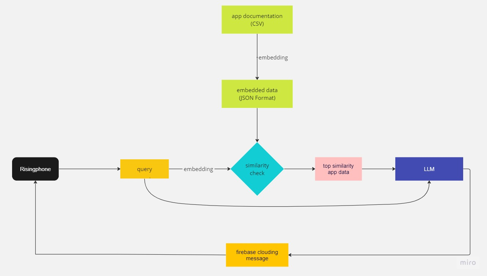

# RisingBrain

All complex software including operating systems will need to be rewritten from the ground up to take advantage of machine learning. In our OS, a AI will manage all apps via plugins, which can be prompted by the user. Our plugins can run as an openai plugin, or in our backend.

## 1. Description

#### 1.1 Achievement

  

#### 1.2 Architecture

  

- make app documentation and embed it.
- embed the query that risingphone sends to local llm
- calculate similarity between embedded app documentation and query and get the best similar app
- get completion based on query and app data using langchain
- send the result to risingphone using firebase clouding message

## 2. Installing / Getting started
#### 2.1 how to run on local
It's a standard flask application so no configuration is needed beyond the included Procfile
#### 2.2 Create firebase project
Create firebase project and take its credentials named .json from Google Cloude IAM. 
#### 2.3 Get Heroku Api key
Deploy it to Heroku in CI/CD automatically whenever there are some changes in main or develop branch.
#### 2.4 Set Github Secrets With its Access Keys
All credentials including openai, replicate and pinecone are shared with Github Secrets to be referenced by Unit Tests of CI/CD on its building

## Contributing
Please refer to each project's style and contribution guidelines for submitting patches and additions. In general, we follow the "fork-and-pull" Git workflow.

 1. **Fork** the repo on GitHub
 2. **Clone** the project to your own machine
 3. **Commit** changes to your own branch
 4. **Push** your work back up to your fork
 5. Submit a **Pull request** so that we can review your changes

NOTE: Be sure to merge the latest from "upstream" before making a pull request!
